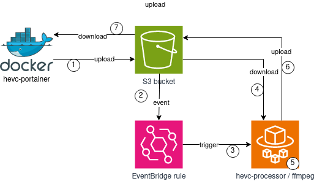

# HEVC-TRANSCODER

## Badges

### Quality

 

### Workflows

 

## Purpose

Transcode all H.264 encoded video files to H.265.

## Technology

Since recoding is a slow and resource hungry, we'd like to have the power of scaling out.

* Docker - self-contained and immutable container platform
* Amazon ECS - fully managed container orchestrator
* AWS Fargate - serverless compute engine
* Amazon S3 - temporary block storage for video files
* Amazon EventBridge - event bus which triggers ECS on S3 events
* FFmpeg - open source transcoder

## Process

The entire process looks like this:

1. `processor.py` searches the filesystem and uploads video files to S3 (`TODO/` prefix)
1. S3 sends an upload event to EventBridge
1. EventBridge triggers a new ECS task (hevc-processor)
1. `transcoder.py` downloads the file from S3
1. `transcoder.py` transcodes the file to H.265
1. `transcoder.py` uploads the file to S3 (`DONE/` prefix)
1. `processor.py` downloads the file from S3

## Build & deploy

A GitHub actions workflow will build the Docker container and configure the AWS infrastructure with Terraform.
The local Docker container is started by [scheduler](https://github.com/melvyndekort/scheduler).

## Development

There are basically 2 important folders within this repository:

* hevc_transcoder
* terraform

### hevc_transcoder

This folder contains a Python project with the 2 main modules `processor.py` and `transcoder.py`.
The project uses **poetry** for dependency management and **pytest** for unit testing.
There is a **Dockerfile** to build the deployable container.

### terraform

This folder contains all the **terraform** code to set up the entire infrastructure within AWS.

## Makefile

There is a **Makefile** with a few targets to make life easier:

* `clean` - delete all generated files
* `install` - download and install the Python dependencies
* `test` - run unit tests
* `build` - create a build (Python wheel)
* `full-build` - build the docker container
* `plan` - run `terraform plan`
* `apply` - run `terraform apply`

## Contributing

Pull requests are welcome. For major changes, please open an issue first to discuss what you would like to change.

Please make sure to update tests as appropriate.

## License

[MIT](https://choosealicense.com/licenses/mit/)
